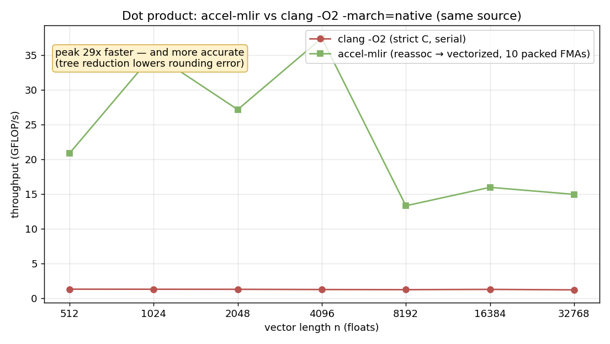

# Optimizations in accel-mlir

The middle-end implements a handful of classic compiler optimizations on the
`accel` dialect. Each is small on purpose — the point is to show the *technique*
and where it lives in MLIR, with both the theory and the implementation.

Run the showcase:

```bash
build/bin/accel-opt examples/strength.mlir --canonicalize
build/bin/accel-opt examples/strength.mlir --canonicalize --cse
```

## 0. The optimization that beats a C compiler (FP reassociation)

The other entries below are *equivalences* — they don't change results, so a
good C compiler does them too. This one is different, and it's the reason a
domain compiler exists at all.

A general C compiler at `-O2` must preserve strict IEEE-754 semantics. Floating-
point addition is **not** associative, so the compiler may **not** reassociate a
reduction. A dot product therefore stays a single-accumulator, latency-bound
serial chain, and does **not** auto-vectorize:

```c
float s = 0;
for (i) s += a[i]*b[i];     // clang -O2: one scalar FMA every ~4 cycles
```

accel-mlir *defines* `accel.mac` to be a fused, **reassociatable** multiply-
accumulate — the exact assumption ML frameworks (PyTorch, XLA) make about
reductions. So [`AccelToLLVM.cpp`](lib/Conversion/AccelToLLVM.cpp) lowers it to
`fmul`+`fadd` carrying `contract reassoc` fast-math flags. That single piece of
**domain knowledge** lets LLVM do what it cannot do for the C loop:

- `reassoc` → the reduction is split across multiple independent accumulators
  and **vectorized** (here: 8-wide AVX × 4 accumulators);
- `contract` → each lane fuses to a hardware FMA.

Measured on [`examples/dot.mlir`](examples/dot.mlir) vs the strict-C loop, **both
compiled `clang -O2 -march=native`** (`benchmark_dot.py`):



- **~10–29× faster** (compute-bound / L1-resident at the top end).
- **More accurate**, not less: tree reduction accumulates ~1–2 orders of
  magnitude less rounding error than the serial sum.

The honest caveat: you *can* hand `clang` `-ffast-math` and it will do the same.
The point is that a domain compiler bakes the *correct-for-the-domain* semantics
in **safely and by default**, instead of forcing the programmer to flip a global,
dangerous flag over their whole program.

## 1. Constant folding (partial evaluation)

If all inputs to an op are known at compile time, evaluate it then and there.
`accel.mac(2, 3, 4)` becomes the constant `10`.

- **Theory:** partial evaluation / constant propagation over the SSA value graph.
- **Code:** `MacOp::fold` and `ConstantOp::fold` in
  [`lib/Accel/AccelOps.cpp`](lib/Accel/AccelOps.cpp). `fold` returns an
  `Attribute`; the dialect's `materializeConstant` hook rebuilds it into an
  `accel.constant`, which is what lets the fold actually replace the op.

## 2. Algebraic identities

Simplifications that hold by the algebra of the operation, regardless of runtime
values: `0*x + c == c`. Implemented as an early return in `MacOp::fold` (returns
operand `c` directly, even when `c` is not constant).

## 3. Strength reduction

Replace an expensive operation with a cheaper one that computes the same result:

| Pattern | Rewrite | Why |
|---|---|---|
| `mac(x, 1, c)` | `x + c` | multiply by one is identity — drop the multiply |
| `mac(x, 2, c)` | `(x + x) + c` | multiply by two → a single add |

- **Theory:** strength reduction — the canonical example is turning multiplies
  into adds/shifts. Here `*2` becomes a self-add.
- **Code:** `StrengthReduceMac` (an `OpRewritePattern<MacOp>`) registered via
  `MacOp::getCanonicalizationPatterns` in
  [`lib/Accel/AccelOps.cpp`](lib/Accel/AccelOps.cpp). It uses `m_ConstantFloat`
  matchers and rewrites into `arith` ops (declared as a dependent dialect so it
  is always available).

## 4. Operator fusion / raising

The inverse direction: recognize the `mul`-then-`add` idiom and contract it into
the single fused `accel.mac`. This is a peephole/raising pass — the same shape
instruction selection uses to map IR onto fused hardware units (FMA, MAC arrays).

- **Code:** `FuseMulAddPattern` in
  [`lib/Conversion/FuseMacPass.cpp`](lib/Conversion/FuseMacPass.cpp), driven by
  the greedy pattern rewriter (`--fuse-mac`).

## 5. CSE and DCE (composed from upstream)

These optimizations compose with MLIR's built-in passes:

- **DCE:** dead `accel.constant`s left behind after strength reduction are
  removed by `--canonicalize` (its dead-code cleanup).
- **CSE:** two identical `accel.mac`s collapse to one under `--cse` — possible
  precisely because `accel.mac` is marked `Pure` (no side effects), so the CSE
  pass is free to deduplicate it.

## How they fit together

```
--fuse-mac        raise arith.mulf+arith.addf  ->  accel.mac
--canonicalize    fold / identities / strength reduction / DCE
--cse             deduplicate pure ops
--convert-*-to-llvm + --reconcile-unrealized-casts    lower to LLVM dialect
```

The op-count effect is visible in the [benchmark](demo/benchmark.png): the
degree-8 Horner polynomial's 16 `arith` ops fuse into 8 `accel.mac`s.
