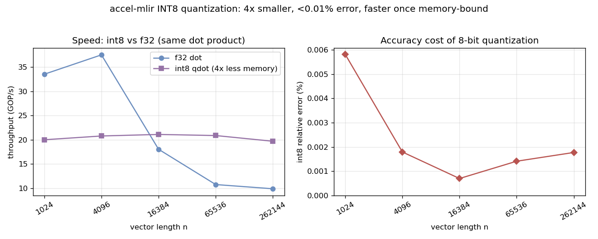

# INT8 quantization in accel-mlir

Quantization is a transformation a general C compiler will **never** do: it
recomputes an `f32` program in `int8` arithmetic. You give up a small, *bounded*
amount of accuracy in exchange for **4× less memory/bandwidth** and access to the
cheap integer MAC units that edge-AI accelerators are built around. This is the
core job of an inference compiler (TFLite, XLA, and the kind of stack at Hailo).

## The primitive

[`accel.qmac`](include/Accel/AccelOps.td) is the quantized MAC:

```mlir
%acc1 = accel.qmac %a, %b, %acc0 : i8, i8, i32     // acc + (i32)a * (i32)b
```

`int8 × int8` multiplied and accumulated into `int32` — a **wide accumulator** so
a long reduction can't overflow (max |sum| of n int8·int8 terms is
`n · 127²`, which stays in int32 for n up to ~10⁸). It lowers to
`sext`/`mul`/`add` ([`AccelToLLVM.cpp`](lib/Conversion/AccelToLLVM.cpp)) and, since
integer addition is associative, vectorizes under plain `-O2`.
[`examples/qdot.mlir`](examples/qdot.mlir) is an int8 dot product built from it.

## The quantization scheme (and its constraints)

Symmetric, per-tensor (`examples/qdot_bench.c`):

```
scale = max|x| / 127
q     = clamp(round(x / scale), -127, 127)      // int8
x ≈ scale · q                                    // dequantize
```

The "keep good accuracy" constraints that make this work:

- **Symmetric** (zero maps to 0) → an `int8×int8` product needs no zero-point
  correction terms, so the inner loop stays a clean integer MAC.
- **`max|x|/127`** uses the full int8 range without saturating real values.
- **`int32` accumulation** so the reduction itself is exact (only the inputs are
  approximated, not the sum).
- **Round-to-nearest + saturation** minimise and bound the per-element error.

For a well-conditioned dot product the per-element quantization error (~0.4%)
largely averages out across the sum, so the result error is far smaller (see
below). Catastrophic cancellation breaks that assumption — then you need
per-channel scales or higher precision; those are the natural next steps.

## Benchmark

`python3 benchmark_quant.py` quantizes f32 data, runs the int8 and f32 kernels
(both emitted by accel-mlir, both `clang -O2 -march=native`), and measures:



- **4× smaller** data, always.
- **Accuracy:** ~10⁻⁵ relative error on a well-conditioned dot — far under 1%.
- **Speed (honest, CPU-specific):** int8 is *slower* than f32 when the data fits
  in L1 (compute-bound), because this CPU has **no int8 dot-product instruction**
  (no AVX-512 VNNI) — the int8 values are widened to `int32` and use the same
  vector width as f32, minus FMA. Once the working set spills cache, int8 wins
  (~2×) purely on **memory bandwidth**.

## The real point

On a CPU the int8 *compute* win is modest, but the **4× memory/model-size**
reduction is unconditional, and that is usually what matters at the edge. The
*compute* win is large on hardware with native int8 MAC arrays (edge NPUs) — which
is exactly the hardware you quantize **for**. accel-mlir's role is the
transformation and the wide-accumulator codegen; the benchmark makes the
trade-off measurable instead of assumed.
