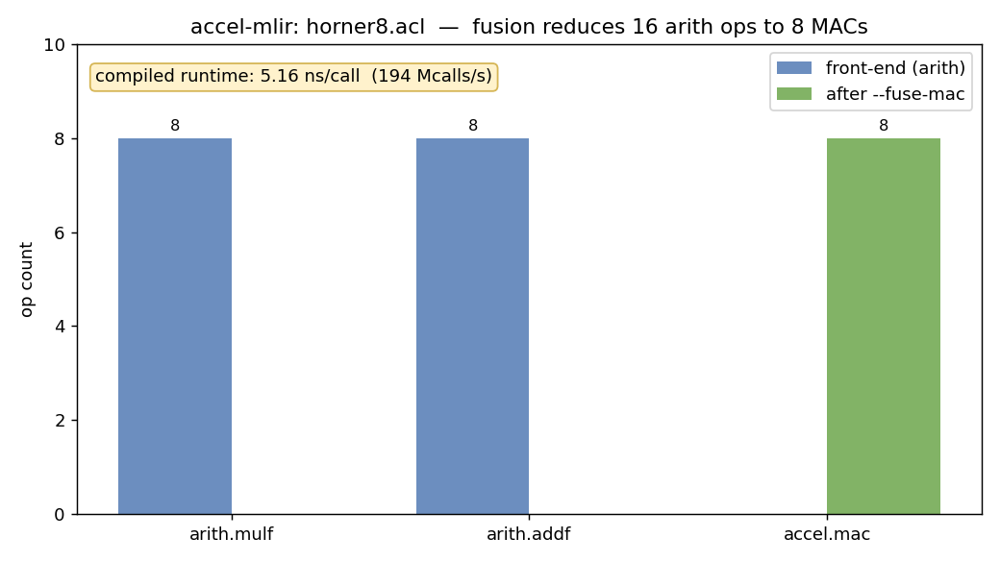

# accel-mlir

A small but **complete compiler** built on MLIR/LLVM: a source language with an
ANTLR front-end, a custom MLIR dialect with real optimizations in the middle,
and lowering all the way to native code.

> **`.acl` source → (ANTLR) → `arith` MLIR → raise to `accel` dialect → optimize → lower to LLVM dialect → LLVM IR → native binary**

The dialect is built around `accel.mac` — fused multiply-accumulate (`a*b + c`),
the primitive at the heart of every AI accelerator and systolic array.

### The pipeline


### Everything it runs (examples · tests · benchmark)


## What it exercises

| Compiler stage | Concept | Where |
|---|---|---|
| **Front-end** | ANTLR grammar + Python codegen (lexer/parser → AST → IR) | [`frontend/Acl.g4`](frontend/Acl.g4), [`frontend/aclc.py`](frontend/aclc.py) |
| **Dialect** | Ops/types in ODS/TableGen, custom asm, verifiers, folders, constant materializer | [`include/Accel/*.td`](include/Accel), [`lib/Accel`](lib/Accel) |
| **Middle-end** | Pattern rewriting (raising), **strength reduction**, folding, CSE/DCE | [`lib/Conversion/FuseMacPass.cpp`](lib/Conversion/FuseMacPass.cpp), [`lib/Accel/AccelOps.cpp`](lib/Accel/AccelOps.cpp), [`OPTIMIZATIONS.md`](OPTIMIZATIONS.md) |
| **Back-end** | Dialect-conversion to LLVM (`ConversionTarget`, `TypeConverter`, 1→many lowering), codegen | [`lib/Conversion/AccelToLLVM.cpp`](lib/Conversion/AccelToLLVM.cpp), [`run_demo.sh`](run_demo.sh) |
| **Driver** | An `mlir-opt`-style tool | [`tools/accel-opt`](tools/accel-opt) |

## Build

Built against the **distro LLVM/MLIR 21** packages — no source build required.

```bash
sudo apt-get install -y libmlir-21-dev mlir-21-tools llvm-21-dev clang-21 lld-21

cmake -G Ninja -B build \
  -DMLIR_DIR=/usr/lib/llvm-21/lib/cmake/mlir \
  -DLLVM_DIR=/usr/lib/llvm-21/lib/cmake/llvm \
  -DCMAKE_C_COMPILER=clang-21 -DCMAKE_CXX_COMPILER=clang++-21
cmake --build build

# the front-end needs the ANTLR Python runtime:
python3 -m venv .venv && .venv/bin/pip install -r frontend/requirements.txt
```

## The front-end: Acl

[`Acl.g4`](frontend/Acl.g4) defines a tiny float expression language. The
ANTLR-generated parser feeds [`aclc.py`](frontend/aclc.py), which walks the tree
and emits accel-dialect MLIR — the classic *lexer/parser → AST → IR generation*.

```bash
echo 'def quad(x) = 2*x*x + 3*x + 5;' > /tmp/q.acl
.venv/bin/python frontend/aclc.py /tmp/q.acl        # -> func.func @quad with arith ops
.venv/bin/python frontend/aclc.py /tmp/q.acl | build/bin/accel-opt --fuse-mac   # raised to accel.mac
```

Regenerate the parser from the grammar with `frontend/generate.sh` (needs Java +
the ANTLR jar; see [`frontend/tools/`](frontend/tools)).

## Optimizations

The middle-end implements several classic optimizations on `accel.mac`; see
**[OPTIMIZATIONS.md](OPTIMIZATIONS.md)** for the theory and code pointers.

```bash
build/bin/accel-opt examples/strength.mlir --canonicalize        # strength reduction + folding
build/bin/accel-opt examples/strength.mlir --canonicalize --cse  # + common-subexpression elimination
```

- `mac(x, 1, c) → x + c` — multiply-by-one elimination
- `mac(x, 2, c) → (x + x) + c` — **strength reduction** (mul → add)
- `mac(2, 3, 4) → 10` — constant folding + materialization
- dead constants removed (DCE); duplicate MACs merged (CSE)

## Benchmark

`benchmark.py` runs the pipeline on a degree-8 Horner polynomial
([`examples/horner8.acl`](examples/horner8.acl)), reports the op-count reduction
from fusion plus the compiled throughput, and renders a chart:

```bash
python3 benchmark.py     # writes demo/benchmark.png
```



## Examples

Each lives in [`examples/`](examples). `./run_examples.sh` compiles every runnable
one (including the `.acl` front-end source) to a native binary and checks the result.

| File | What it shows |
|---|---|
| [`mac.mlir`](examples/mac.mlir) | The base case: one MAC in `arith`, raised then lowered. |
| [`dot4.mlir`](examples/dot4.mlir) | A 4-element dot product → a **chain of 4 `accel.mac`** (a MAC array). |
| [`poly.mlir`](examples/poly.mlir) | Horner polynomial written **directly in the dialect**. |
| [`fold.mlir`](examples/fold.mlir) | The folders + constant materializer under `--canonicalize`. |
| [`strength.mlir`](examples/strength.mlir) | The **optimization showcase** (strength reduction, folding, CSE). |
| [`quadratic.acl`](examples/quadratic.acl) | Source compiled by the **ANTLR front-end** end to end. |
| [`horner8.acl`](examples/horner8.acl) | The benchmark input (degree-8 polynomial → 8 MACs). |

```bash
./run_examples.sh
# PASS  compute(2, 3, 4) = 10.0 (expected 10.0)
# PASS  dot4([1,2,3,4], [5,6,7,8]) = 70.0 (expected 70.0)
# PASS  poly(2) = 41.0 (expected 41.0)
# PASS  quad(2) = 19.0 (expected 19.0)
# === 4 passed, 0 failed ===
```

## Tests

`test/*.mlir` are `FileCheck` tests covering round-tripping, the fuse pass, the
lowering, and the canonicalizer:

```bash
./run_tests.sh
# PASS  roundtrip.mlir
# PASS  fuse.mlir
# PASS  lower.mlir
# PASS  canonicalize.mlir
# === 4 passed, 0 failed ===
```

## Recording the demos

The GIFs are generated from real command output:

```bash
python3 demo/make_cast.py            # runs the commands, writes demo/*.cast
agg demo/pipeline.cast demo/pipeline.gif
agg demo/run.cast      demo/run.gif  # (asciinema-gif generator)
```
